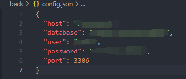

<!-- [TOC] -->

[1. front](#front)
[1.1 init](#init)
[2. back](#back)
[2.1 init](#init-1)
# front:
## init:

>npm install
if you're in China,use "**cnpm install**" instead

>system hide the home page instead with a search page,because I don't have much time to add big data part.

>You can offer students and teacher a platform to study course video ,share files and finish assignments in this system.

>you can also post a blog or read other user's blog.

>if you need to start a website,run **npm run build**, then put the files in dist in you php server.

# back:
## init:
>you need to set a **config.json** first, and the form just like this. 

>you nead to pip install flask,flask_cors,pymysql.
update pip before installing these wheels
because flask_cors is not in the default pip list

